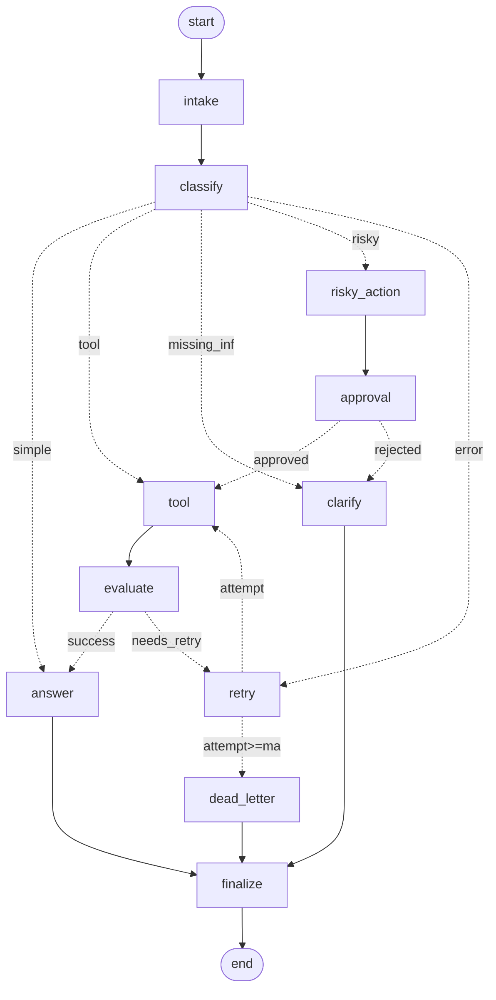

# Day 08 Lab Report

## 1. Team / student

- **Name:** Nguyen Hoang Long
- **Repo/commit:** day08-langgraph-agent-lab @ `6d8252d`
- **Date:** 2026-06-30
- **LLM provider:** OpenRouter (OpenAI-compatible gateway), model configured via `OPENROUTER_MODEL`

## 2. Architecture

The workflow is a `StateGraph` of **11 nodes** that models a support-ticket agent.
A single shared `AgentState` (TypedDict) flows through the graph; each node returns
a *partial* update that LangGraph merges using per-field reducers.

```text
START → intake → classify ─┬─ simple       → answer ───────────────┐
                           ├─ tool         → tool → evaluate ─┐     │
                           ├─ missing_info → clarify ─────────┼─────┤
                           ├─ risky        → risky_action      │     │
                           │                  → approval ─┐    │     │
                           └─ error        → retry ───┐   │    │     │
                                                      ▼   ▼    ▼     ▼
                          (approved)  tool ◄──────── retry  answer  finalize → END
                           evaluate ──success──────► answer          ▲
                                   └─needs_retry──► retry ─┐         │
                                                           ▼         │
                              (attempt≥max) dead_letter ───┴─────────┘
```

Rendered topology (exported via `build_graph().get_graph().draw_mermaid()`):



**Node roles**

| Node | Responsibility | LLM? |
|---|---|---|
| `intake` | normalize the raw query, open the audit trail | no |
| `classify` | structured-output intent classification → `route`, `risk_level` | **yes** |
| `tool` | mock tool call with transient-failure simulation for the `error` route | no |
| `evaluate` | retry gate: `ERROR` → `needs_retry`, else LLM-as-judge confirms `success` | yes (advisory) |
| `answer` | grounded final response from query + tool results + approval | **yes** |
| `clarify` | ask one specific question for vague tickets / rejected actions | yes |
| `risky_action` | describe the side-effecting action awaiting approval | no |
| `approval` | human-in-the-loop gate (mock-approve by default; `interrupt()` opt-in) | no |
| `retry` | increment `attempt`, log the transient failure | no |
| `dead_letter` | escalate after retries are exhausted | no |
| `finalize` | emit the terminal audit event — every path passes through here | no |

**Edges.** Fixed edges wire the deterministic hops (`START→intake`, `intake→classify`,
`tool→evaluate`, `risky_action→approval`, `answer/clarify/dead_letter→finalize→END`).
Four **conditional** edges encode the branching logic via the functions in
`routing.py`: `route_after_classify`, `route_after_evaluate`, `route_after_retry`
(the bounded-loop guard), and `route_after_approval`.

## 3. State schema

| Field | Reducer | Why |
|---|---|---|
| `thread_id`, `scenario_id`, `query` | overwrite | identity / input, set once |
| `route`, `risk_level` | overwrite | current classification only |
| `attempt`, `max_attempts` | overwrite | current retry counter + bound |
| `final_answer` | overwrite | the single resolved answer |
| `evaluation_result` | overwrite | drives the `route_after_evaluate` gate |
| `pending_question` | overwrite | clarification text for `missing_info` |
| `proposed_action` | overwrite | description handed to the approval gate |
| `approval` | overwrite | latest HITL decision (`approved/reviewer/comment`) |
| `messages` | **append** (`operator.add`) | human-readable step trace |
| `tool_results` | **append** | every tool output, for grounding + evaluation |
| `errors` | **append** | every transient failure, for audit |
| `events` | **append** | structured `LabEvent`s — the metrics are computed from these |

Rule of thumb used: **history is append-only, current control state is overwrite.**
Keeping scalars as overwrite avoids reducer conflicts and keeps the serialized
checkpoint lean.

## 4. Scenario results

Summary (`outputs/metrics.json`):

| Metric | Value |
|---|---|
| Total scenarios | 7 |
| Success rate | 100% |
| Avg nodes visited | 6.4 |
| Total retries | 3 |
| Total interrupts (HITL) | 2 |
| Resume demonstrated | ✅ |

Per scenario:

| Scenario | Expected | Actual | Success | Retries | Interrupts | Appr.req | Appr.obs | Nodes |
|---|---|---|:---:|---:|---:|:---:|:---:|---:|
| S01_simple | simple | simple | ✅ | 0 | 0 | ❌ | ❌ | 4 |
| S02_tool | tool | tool | ✅ | 0 | 0 | ❌ | ❌ | 6 |
| S03_missing | missing_info | missing_info | ✅ | 0 | 0 | ❌ | ❌ | 4 |
| S04_risky | risky | risky | ✅ | 0 | 1 | ✅ | ✅ | 8 |
| S05_error | error | error | ✅ | 2 | 0 | ❌ | ❌ | 10 |
| S06_delete | risky | risky | ✅ | 0 | 1 | ✅ | ✅ | 8 |
| S07_dead_letter | error | error | ✅ | 1 | 0 | ❌ | ❌ | 5 |

## 5. Failure analysis

1. **Transient tool failure / bounded retry.** The `error` route deliberately makes
   `tool` fail on early attempts. `evaluate` detects the `ERROR` marker and returns
   `needs_retry`, sending control to `retry`, which increments `attempt`.
   `route_after_retry` only loops back to `tool` while `attempt < max_attempts`;
   otherwise it diverts to `dead_letter`. This guarantees termination — there is no
   unbounded loop. Scenario **S07** (`max_attempts=1`) exercises the give-up path and
   lands in the dead-letter queue with an escalation message.

2. **Risky action without approval.** Side-effecting requests (refund, delete, send
   email) are classified `risky` and can never reach `tool` directly — they must pass
   `risky_action → approval`. `route_after_approval` only proceeds to `tool` when the
   decision is `approved`; a rejection is routed to `clarify` to request an
   alternative. This makes "execute an irreversible action with no human sign-off"
   structurally impossible in the graph. A second-order failure considered: a flaky
   LLM classification. `classify` uses **structured output** for reliability and falls
   back to a priority-ordered keyword heuristic if the API call fails, so a network
   blip degrades gracefully instead of crashing the run.

## 6. Persistence / recovery evidence

- Every run is keyed by `thread_id` (`thread-<scenario_id>`), passed to
  `graph.invoke(..., config={"configurable": {"thread_id": ...}})`.
- `build_checkpointer("memory")` is the default for fast offline runs.
- `build_checkpointer("sqlite")` returns a `SqliteSaver` backed by
  `outputs/checkpoints.sqlite` in **WAL mode** (`PRAGMA journal_mode=WAL`), created
  via `sqlite3.connect(..., check_same_thread=False)` and `saver.setup()`. Because the
  state is written to disk per checkpoint, a run can be resumed after a process exit
  using the same `thread_id`, and the full step history is available via
  `graph.get_state_history(config)`.
- `make run-scenarios` runs a persistence self-check (`_persistence_self_check` in
  `cli.py`): it executes a scenario through SQLite, rebuilds a *fresh* graph object
  from the on-disk DB, and recovers the checkpoint history — setting
  `resume_success` in the metrics.

**Crash-resume demo** (`scripts/demo_persistence.py`, `LANGGRAPH_INTERRUPT=true`):
the graph pauses at the approval `interrupt()`, the process is discarded, and a brand
new graph rebuilt from SQLite resumes with the human's decision:

```text
=== Process A: run until the approval interrupt ===
  paused. route so far: risky
  interrupt asked: Approve this action? Provide {approved, comment}.

=== Process B: rebuild from SQLite and resume with the human decision ===
  recovered pending node: ('approval',) | attempt: 0
  resumed -> route: risky | approval: {'approved': True, 'reviewer': 'human', 'comment': 'Refund approved by supervisor.'}
  final answer: I've processed your refund request. You will receive a confirmation email shortl

RESUME_SUCCESS: True
checkpoints in history: 10
```

## 7. Extension work

- **SQLite persistence** — durable checkpointer with WAL mode (`persistence.py`).
- **LLM-as-judge** — `evaluate` asks the model for a 0–10 quality score (advisory,
  recorded in event metadata) on top of the deterministic `ERROR` guard.
- **Resilient LLM integration** — structured-output classification + grounded answer
  generation through OpenRouter, each with a graceful non-LLM fallback.
- **Optional real HITL** — set `LANGGRAPH_INTERRUPT=true` to pause `approval` with
  `langgraph.types.interrupt()` and resume with a human decision.
- **Graph diagram** — `build_graph().get_graph().draw_mermaid()` exports the topology.

## 8. Improvement plan

With one more day I would productionize, in order:

1. **Real HITL queue** — replace mock approval with `interrupt()` + a durable
   approval queue (so a reviewer can approve hours later via the SQLite checkpoint).
2. **Real tools** — swap the mock `tool` for actual order-lookup / refund APIs with
   typed I/O, timeouts, and idempotency keys.
3. **Observability** — wire LangSmith tracing and emit `latency_ms` per node to a
   metrics backend; alert on dead-letter volume and retry rate.
4. **Classifier hardening** — add a small eval set + confidence threshold, routing
   low-confidence tickets to `clarify` instead of guessing.
